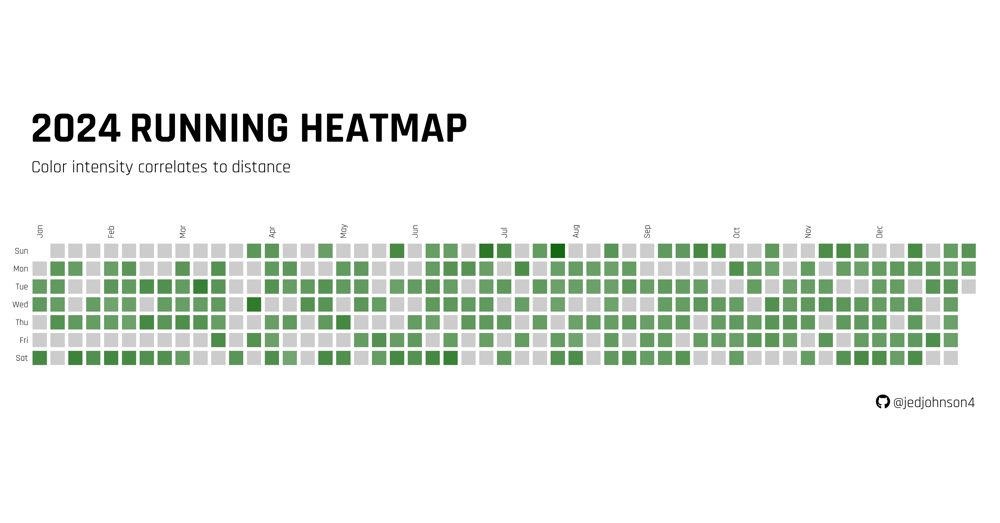
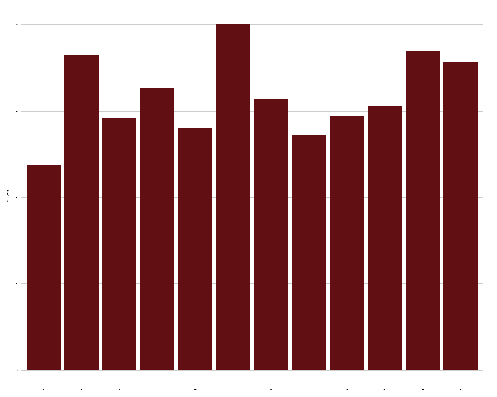
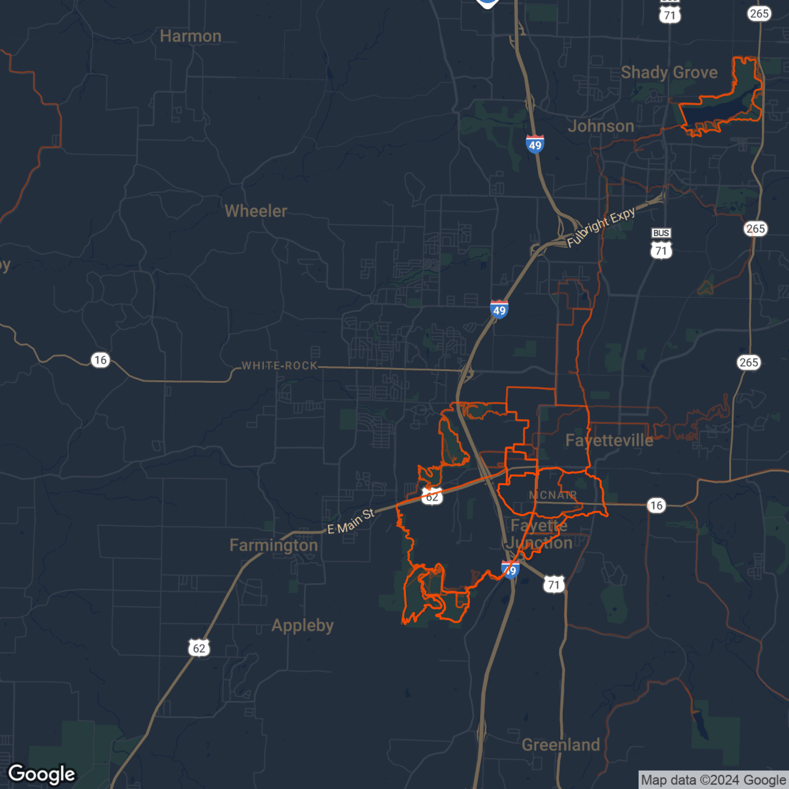
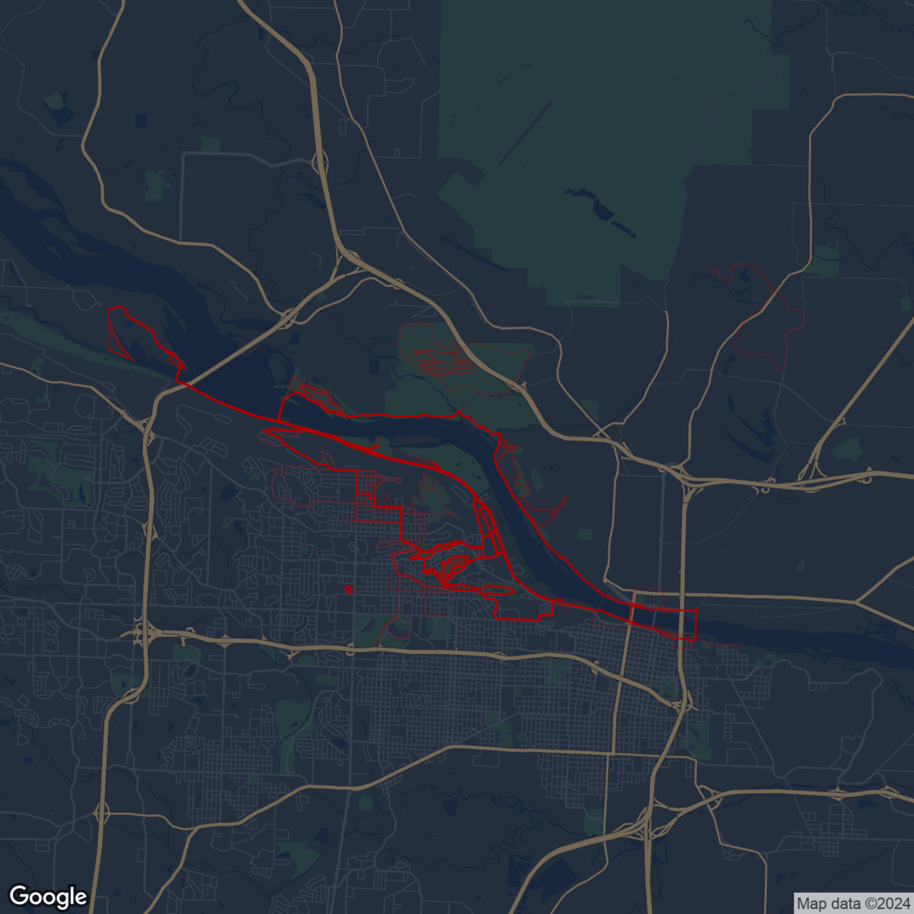
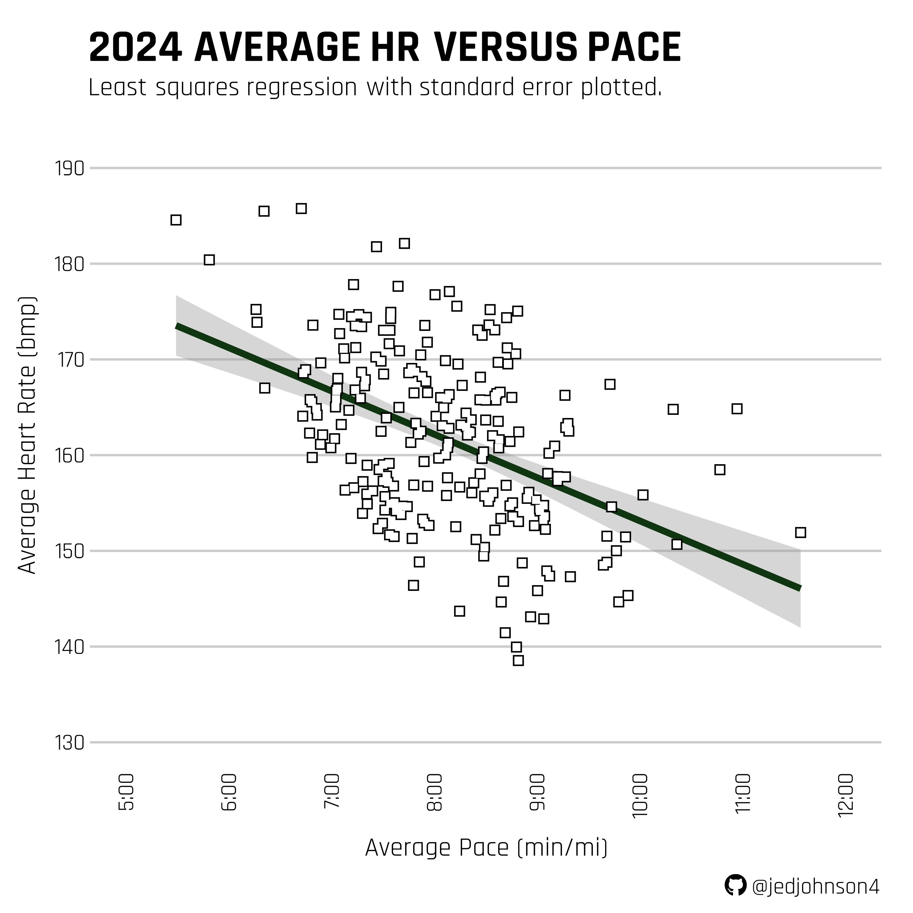
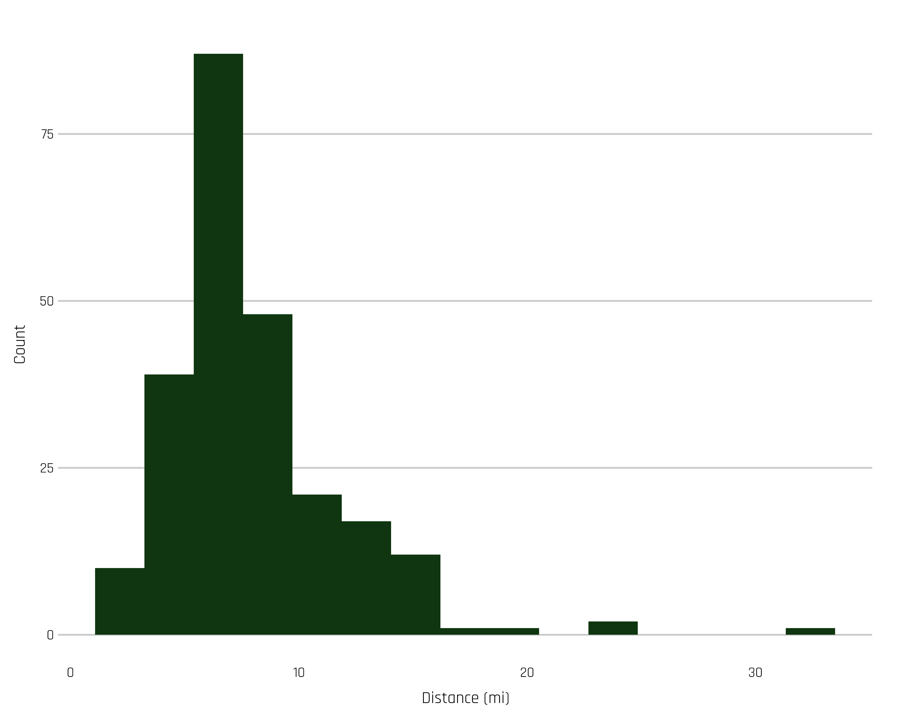
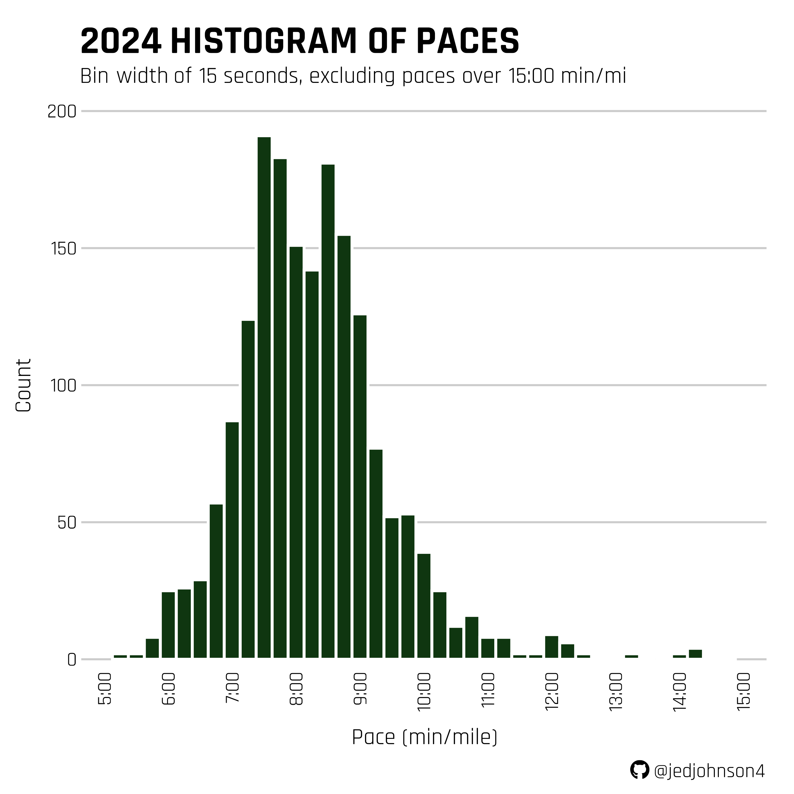

# Visualization of Jed's Running Data from 2024

------------------------------------------------------------------------

### Introduction

Garmin data was exported from the following link <https://www.garmin.com/en-US/account/datamanagement/>. To access files, navigate DI_CONNECT \> DI-Connect-Uploaded-Files and unzip folder.

In this visualization, the following packages were used:

1. `FITfileR` to read FIT files downloaded from Garmin.
2. `tidyverse` to import dplyr/ggplot for data manipulation/visualization.
3. `ggmap` to access map data from Google.

---

### Summary of 2024

{width="800"}

{width="400"}

------------------------------------------------------------------------

### Running Heat Maps

{width="400"}
{width="400"}

---

### Other Visualizations

{width="400"}

{width="400"}

{width="400"}
